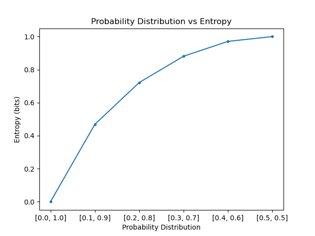
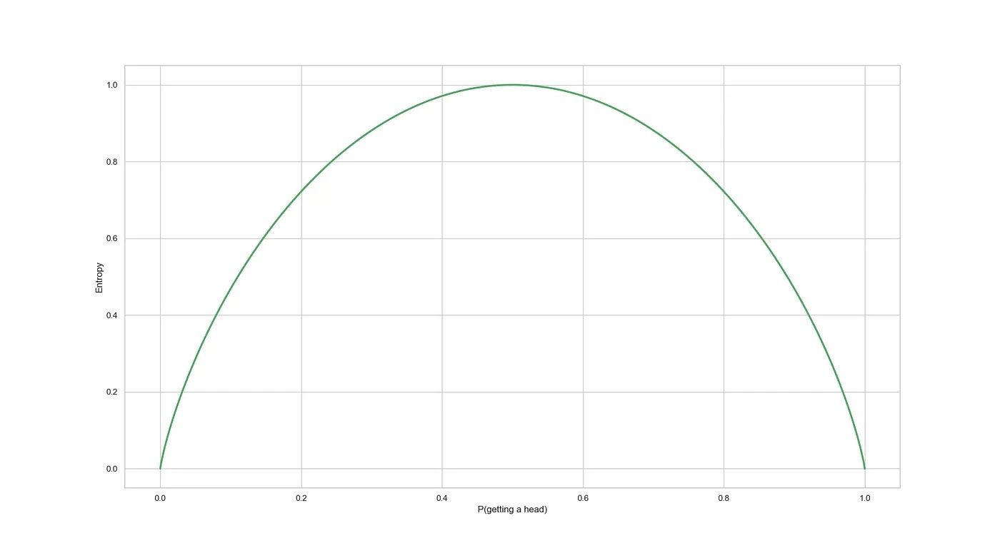

This post is adapted from my IB Math internal assessment, where it received the highest score in the IB system. It still has some of that school-essay shape, but I wanted to share it because it was one of the first times I connected programming, math, and security.

## Introduction

After practicing programming for over a year, I wanted to test my skills on a real project. I was fourteen and eager to build something noteworthy, so I settled on a simple password creator: an application that would produce a password from a chosen set of characters and a chosen length.

After implementing it, I noticed that popular password managers like Bitwarden also judge the _strength_ of a password. I tried to add that feature, but I was immediately overwhelmed by the mathematics and ended up dropping it.

Later, when my teacher suggested doing the maths exploration on something I could use daily, I remembered that first project. I had found my topic. After some research I came across "The Mathematics of (Hacking) Passwords" (Delahaye, 2019), and I was hooked. Password entropy is measured in bits and represents how unpredictable, and therefore un-guessable, a password is (Okta, 2022).

My aim in this exploration is to use mathematics to explore password entropy and build a simple model that estimates password strength under explicit assumptions. I also want to explore the general mathematics behind passwords and how it can be extended.

## Understanding passwords

At its most basic, a password is a combination of elements at a certain length. Within the realm of unique options, there is a figurative space of possibilities.

If we are told to create a password of $l$ symbols, where each symbol is chosen from a finite set $A = \{a_{1}, a_{2}, \dots, a_{n}\}$, the total number of possibilities $p$ is

$$p = |A|^{l}$$

with $l$ being the length of the password and $|A|$ being the cardinality (number of elements) of set $A$.

Passwords are often cracked through attacks that try to guess the correct sequence of symbols. The most common — and the one this investigation focuses on — is the _brute force attack_: a trial-and-error approach to guessing a password correctly. The security of a password against such attacks is measured by its strength, otherwise known as its **entropy**.

## Understanding entropy in information theory

From a security standpoint, there is no real difference between $1{,}000{,}000$ and $1{,}001{,}000$ variations: both numbers are of the same magnitude. For that reason, we use the magnitude rather than the exact number — the logarithm of the variations.

A binary logarithm is the usual choice, with results measured in bits. Computers handle binary naturally, and bits are a clean measure of strength: a low number of bits means a password is very easy to crack, and a high number means it is hard to brute force.

To find the password entropy, the equation

$$E = \log_{2}\left(R^{L}\right)$$

is used, where $E$ is password entropy, $R$ is the number of possible characters within the password, and $L$ is the number of characters in the password.

As I researched further, however, I realized that this equation only works cleanly under a very specific model.

### Password requirements

82% of e-commerce sites have very complex password requirements (Scott, 2022). The entropy function $E = \log_{2}\left(R^{L}\right)$ assumes a fixed length, a fixed alphabet, and uniform random choice from that alphabet. Password requirements change the set of allowed strings, so the simple formula no longer tells the whole story.

For this reason I will be using information theory and Shannon entropy. But first, the concepts of "randomness" and a few other techniques deserve a quick detour.

Suppose a fair coin is flipped $n \geq 2$ times, and assume the flips are independent. If we define $X$ as the number of flips that come up heads, then $X$ depends on the coin flips. In other words, $X$ is the outcome of a randomized experiment, which makes $X$ random.

In probability and statistics, this is called a **random variable**: an abstract way to talk about experimental outcomes that lets us apply probability theory flexibly. A random variable is _discrete_ if its domain consists of a finite set of values, and _continuous_ if its domain is uncountably infinite.

The probability that a discrete random variable $X$ takes on a particular value $x$ — that is, $P(X = x)$ — is often denoted $f(x)$ and called the **probability mass function**. Since $f(x)$ is a function, it can be presented graphically or as a formula.

With that out of the way, let's look at information theory.

### Information theory

Information theory is a branch of applied mathematics that revolves around quantifying how much information is present in a signal or communication. A foundational concept is the quantification of the amount of information in events, random variables, and distributions.

One way to understand "amount of information" in a variable is to tie it to how easy it is to _guess_: the easier it is to guess the value, the less information the variable carries. Rare events are more uncertain and require more information to represent than common ones.

We want to quantify information in a way that formalizes three intuitions:

- Likely events should have low information content. Events guaranteed to happen should have none.
- Less likely events should have higher information content.
- Independent events should have additive information. Learning that a coin came up heads twice should convey twice as much information as learning it came up heads once.

To satisfy these properties, we define the **self-information** of a discrete random variable $X = x$ as

$$H(x) = -\log_{2}P(x)$$

where $H(x)$ is the information and $P(x)$ is the probability of the event. Bits are used here for the same reason as before. Other logarithms work too — $\ln x$ is also common — and the negative sign ensures $H(x) \geq 0$.

For example, in a single coin flip the probability of heads (and tails) is $0.5$, so $P(x) = 0.5$ and

$$
\begin{aligned}
H(X = x) &= -\log_{2}(0.5) \\
H(X = h) &= H(X = t) = 1
\end{aligned}
$$

If the same coin were flipped $n$ times, the information for the sequence would be $n$ bits. If instead the coin were biased and the probability of heads were $0.1$, the information would be

$$
\begin{aligned}
H(X = x) &= -\log_{2}(0.1) \\
H(X = h) &\approx 3.332
\end{aligned}
$$

The rarer event (probability $0.1$) carries more bits of information. Plotting self-information for probabilities between $0$ and $1$ gives:

As the probability increases, the self-information decreases. But self-information only deals with a single outcome. To compute the entropy of a password, we need to account for _all_ outcomes of a variable.

Claude Shannon showed that, given $n$ events with probabilities $p_{i}$, the information in a single event is not enough. We need the expected information across the whole distribution. The self-information $I(x_i)$ is itself a random variable, since it depends on the random event $x_i$. In other words, the Shannon entropy of a distribution is the _expected_ amount of information in an event drawn from that distribution.

In probability analysis, the expected value is calculated by multiplying each possible outcome by its likelihood and summing the results. Using that definition, the equation can be rewritten as

$$H(X) = -\sum_{i = 1}^{n} P(x_{i}) \cdot \log_{2} P(x_{i})$$

where $H(X)$ is now the total amount of information in the full probability distribution. For the fair coin, both outcomes have probability $P(X = H) = P(X = T) = 0.5$, so

$$H(X) = -\left[0.5 \log_{2} 0.5 + 0.5 \log_{2} 0.5\right] = 1 \text{ bit}$$

and for the biased coin:

$$H(X) = -\left[0.1 \log_{2} 0.1 + 0.9 \log_{2} 0.9\right] \approx 0.47 \text{ bits}$$

As shown above, the more uncertainty there is in a probability distribution, the more Shannon entropy it has.

This works well for a password of one character. But no one uses a one-character password (hopefully), so we need to extend the formula to every character. If we flip two coins, we'd like to define the entropy of both tosses together. Let the first coin toss be $X$ and the second be $Y$:

$$
\begin{aligned}
H(X, Y) &= -\sum_{i = 1}^{n} P(x_{i}, y_{i}) \cdot \log_{2} P(x_{i}, y_{i}) \\
H(X, Y) &= -\left[0.5 \log_{2} 0.5 + 0.5 \log_{2} 0.5\right] - \left[0.5 \log_{2} 0.5 + 0.5 \log_{2} 0.5\right] \\
H(X, Y) &= 2 \text{ bits} = 2 \cdot H(X)
\end{aligned}
$$

More generally, $H(X_1, X_2, \dots, X_l) = l \cdot H(X)$, where $l$ is the length of the password:

$$l \cdot H(X) = -l \cdot \left(\sum_{x}^{n} P(x) \cdot \log_{2} P(x)\right)$$

It's worth noting that the simplified form $l \cdot H(X)$ assumes each character is generated independently from the same distribution. When the distribution is uniform, all outcomes are equally likely. For one fair coin flip, that means each outcome has probability $\frac{1}{2}$.

Shannon entropy gives a lot more flexibility than the original password entropy equation. Someone well-versed in machine learning or semiotics could even extend it to account for apparent repetitions in letters or other patterns.

### Sanity-checking on a real password

Let's analyze one of my old passwords (already leaked in a breach, don't worry) just to confirm the formula gives reasonable results under the uniform-random model. We'll use my first password ever: `passion87`.

Let $l = 9$ be the length, with $A = \{a, b, \dots, z\}$, $B = \{0, 1, \dots, 9\}$, $C = \{A, B, \dots, Z\}$, and $D = \{!, @, \dots, '\}$, where $X = A \cup B \cup C \cup D$. Then

$$
\begin{aligned}
9 H(X) &= -9 \sum_{x = 1}^{n} \frac{1}{95} \cdot \log_{2} \frac{1}{95} \\
&\approx 59.12 \text{ bits}
\end{aligned}
$$

Using the original entropy formula $E = \log_{2}\left(R^{L}\right)$ on the same password:

$$
\begin{aligned}
E &= \log_{2} 95^{9} \\
&= 9 \cdot \log_{2} 95 \approx 59.12 \text{ bits}
\end{aligned}
$$

| Bits of Entropy | Strength  |
| --------------- | --------- |
| < 64            | Very Weak |
| 64–80           | Weak      |
| 80–100          | Medium    |
| > 100           | Strong    |

Under a uniform distribution, both equations give the same result. That's the win: we have the flexibility of Shannon entropy _and_ the guidelines of the classic password entropy formula. The important caveat is that this is not the same as saying `passion87` was truly a 59-bit password in the real world. Because it looks like a word followed by digits, a realistic attacker would try it much earlier than a random 9-character ASCII string.

### Handling password requirements

So how does entropy actually help us? It's time to return to password requirements. The original goal of those requirements was to keep users from picking trivially weak passwords like `12345` (PasswordBits, n.d.). But with modern brute-force attackers, requirements often hurt more than they help.

Suppose we have the following restrictions:

- The password must be at least $8$ characters long and no more than $16$ characters long.
- The password must contain at least one uppercase letter, one lowercase letter, and one digit.

We have a set of $n = 95$ possible characters: $26$ lowercase letters, $26$ uppercase letters, $10$ digits, and $33$ other printable symbols. Without restrictions, the number of possible 10-character passwords is

$$95^{10}$$

and the entropy is

$$\log_{2}(95^{10}) \approx 65.70 \text{ bits}.$$

If we require at least one uppercase letter, at least one lowercase letter, and at least one digit, some of those $95^{10}$ strings are no longer allowed. The cleanest way to count the remaining strings is by inclusion-exclusion.

Let $N$ be the number of valid 10-character passwords. Start with all possible strings, then subtract the strings that fail at least one requirement:

$$
\begin{aligned}
N ={}& 95^{10} \\
&- 69^{10} - 69^{10} - 85^{10} \\
&+ 43^{10} + 59^{10} + 59^{10} \\
&- 33^{10}
\end{aligned}
$$

The terms have a direct meaning:

- $69^{10}$ counts strings with no uppercase letters.
- $69^{10}$ counts strings with no lowercase letters.
- $85^{10}$ counts strings with no digits.
- $43^{10}$ counts strings with no uppercase and no lowercase letters.
- $59^{10}$ counts strings with no uppercase letters and no digits.
- $59^{10}$ counts strings with no lowercase letters and no digits.
- $33^{10}$ counts strings with none of the three required groups.

Therefore the entropy of a uniformly generated password satisfying the requirements is

$$
\begin{aligned}
H &= \log_{2}(N) \\
&\approx 64.98 \text{ bits}
\end{aligned}
$$

This is slightly lower than the unrestricted $65.70$ bits because the requirements remove possible strings from the search space. The difference is not enormous in this example, but it shows the important mathematical point: if two password systems use the same length and character set, then adding requirements cannot increase the number of valid strings. It can only keep the same strings or remove some of them.

The practical effect can be worse than the pure combinatorics suggests. Requirements often teach users predictable templates: capitalize the first letter, put digits at the end, replace `a` with `@`, or add an exclamation mark. A password like `Summer2024!` technically satisfies many requirements, but it is much more guessable than a uniformly random string with the same length and character set.

So the better lesson is not that every password requirement is bad. It is that password entropy is a property of the generation process, not just the final string. Requirements can shrink the formal search space, and they can also make human-chosen passwords more predictable. This is why length, randomness, and blocking known-compromised passwords are often more useful than forcing specific character categories.

## Conclusion

In this exploration, I dug into the mathematics behind passwords and built a more careful way to reason about password entropy. By applying Shannon entropy, combinatorics, and information theory, I deepened my understanding of passwords and could finally see why judging a password depends so much on how it was generated.

Information theory, first introduced in the 20th century, has been instrumental in designing optimal codes and calculating the expected length of messages sampled from specific probability distributions (Goodfellow et al., 2016).

I am proud to have gained an appreciation for the mathematics behind passwords. They were far more complex than I'd assumed at fourteen, and revisiting them again left me just as stunned by the depth of the math involved.

### Reflection

My aim was to use mathematics to explore password entropy and build a simple model for reasoning about password strength, which I did. I also wanted to explore the general mathematics behind passwords, which I did to some extent.

While researching information theory and entropy — and staring at intimidating equations and graphs — I often felt lost. But slowly, I broke it down piece by piece. I read papers that went deeper into mathematics I couldn't include here, just to keep exploring password mathematics and Markov chains. The challenges became opportunities rather than obstacles.

### Limitations

The first limitation is that the complex mathematics behind passwords had to be simplified to fit this internal assessment. Dictionary attacks are much more common in real-world hacking, but they were beyond what I could mathematically explore at my level. That's something I'd like to revisit.

The second limitation is that I assumed a uniform random distribution throughout. This kept the investigation tractable, but the mathematics could be extended further by someone with more background in semiotics and information theory.

### Strengths

Despite the limitations, I'm confident in the direction of the results. By using entropy as a foundation, the password model can be extended with much more sophisticated tools — Kullback–Leibler divergence, cross-entropy, structured probabilistic models. I'm proud of building a malleable way of thinking that can be simplified, complicated, and reshaped depending on who uses it.

### Closing thoughts

Throughout this exploration, I learned about information theory, password entropy, and the mathematics behind passwords. I also learned that when I meet a challenge, I should think about how to _approach_ it rather than charging at it head-on — figuring out the probability distributions first, for instance, made everything else fall into place.

Every part of Shannon entropy, and of information theory more broadly, has a logical reason behind it. The deeper I went, the more excited I got. As Edsger W. Dijkstra said, "There should be no such thing as boring mathematics."
